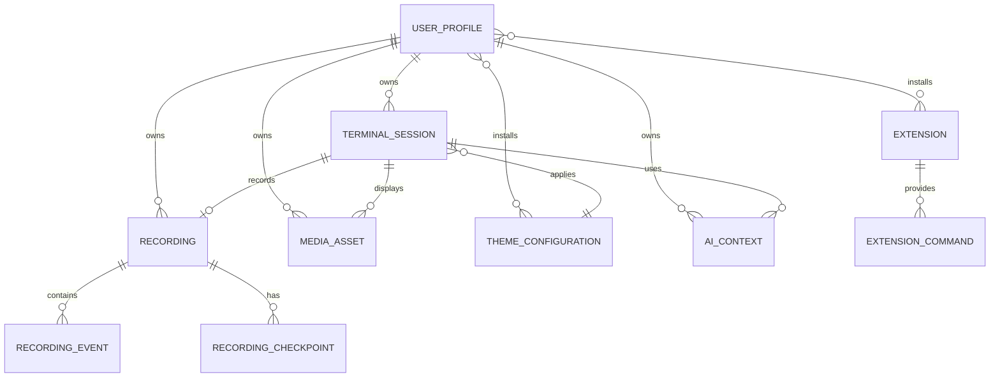

# Data Model: Web-Based Terminal Emulator

**Date**: 2025-09-25
**Feature**: Web-Based Terminal Emulator
**Status**: Complete

## Overview

This document defines the core entities, their relationships, and data structures for the Web-Based Terminal Emulator. The model supports terminal sessions, multimedia rendering, AI interactions, session recording, themes, and extensions.

## Core Entities

### 1. Terminal Session

**Purpose**: Represents an active or historical terminal instance with its state and metadata.

**Properties**:
- `sessionId`: String (UUID) - Unique identifier for the session
- `userId`: String (UUID) - Reference to the user who owns the session
- `status`: Enum - `active`, `inactive`, `terminated`, `recording`
- `createdAt`: DateTime (ISO-8601) - Session creation timestamp
- `lastActiveAt`: DateTime (ISO-8601) - Last activity timestamp
- `terminatedAt`: DateTime (Optional) - Session termination timestamp
- `terminalSize`: Object - `{cols: Number, rows: Number}`
- `workingDirectory`: String - Current working directory path
- `environmentVariables`: Map<String, String> - Session environment variables
- `shellType`: String - Shell type (bash, zsh, fish, etc.)
- `shellPid`: Number - Process ID of the shell
- `recordingEnabled`: Boolean - Whether session recording is active
- `aiAssistantEnabled`: Boolean - Whether AI assistance is enabled
- `themeId`: String (Optional) - Reference to active theme
- `metadata`: Object - Additional session metadata

**Validation Rules**:
- `sessionId` must be unique across all sessions
- `terminalSize.cols` must be between 20 and 500
- `terminalSize.rows` must be between 5 and 200
- `status` transitions: `active` → `inactive` → `terminated`
- `lastActiveAt` must be >= `createdAt`

**State Transitions**:
```
[Created] → active → inactive → terminated
            ↓         ↑
         recording → active
```

**Relationships**:
- One-to-One with Recording (when recording enabled)
- One-to-Many with Media Assets (embedded content)
- One-to-Many with AI Context entries
- Many-to-One with User Profile
- Many-to-One with Theme Configuration (optional)

---

### 2. Recording

**Purpose**: Contains timestamped input/output data and metadata for terminal session playback.

**Properties**:
- `recordingId`: String (UUID) - Unique identifier for the recording
- `sessionId`: String (UUID) - Reference to the terminal session
- `userId`: String (UUID) - Reference to the user who owns the recording
- `startTime`: DateTime (ISO-8601) - Recording start timestamp
- `endTime`: DateTime (Optional) - Recording end timestamp (null if active)
- `duration`: Number - Recording duration in milliseconds
- `status`: Enum - `recording`, `stopped`, `processing`, `ready`, `failed`
- `fileSize`: Number - Total recording file size in bytes
- `eventCount`: Number - Total number of recorded events
- `terminalSize`: Object - `{cols: Number, rows: Number}`
- `exportFormats`: Array<String> - Available export formats ["json", "gif", "mp4", "txt"]
- `compressionRatio`: Number - Compression ratio achieved
- `metadata`: Object - Additional recording metadata
- `events`: Array<RecordingEvent> - Array of recorded events
- `checkpoints`: Array<RecordingCheckpoint> - Playback checkpoints for seeking

**RecordingEvent Schema**:
```json
{
  "timestamp": "ISO-8601",
  "deltaTime": "Number (milliseconds from previous event)",
  "type": "input|output|resize|media|ai|control",
  "data": "String|Binary",
  "size": "Number (bytes)",
  "metadata": {
    "command": "String (for input events)",
    "exitCode": "Number (for command completion)",
    "mediaType": "String (for media events)"
  }
}
```

**RecordingCheckpoint Schema**:
```json
{
  "timestamp": "ISO-8601",
  "eventIndex": "Number",
  "terminalState": "String (compressed terminal buffer)",
  "description": "String (auto-generated or user-defined)"
}
```

**Validation Rules**:
- `recordingId` must be unique across all recordings
- `duration` must match `endTime - startTime` when stopped
- `events` must be chronologically ordered by timestamp
- `fileSize` must not exceed 100MB per recording
- Events older than 30 days are automatically deleted

**State Transitions**:
```
[Created] → recording → stopped → processing → ready
                   ↓                          ↓
                  failed ← processing ← stopped
```

**Relationships**:
- One-to-One with Terminal Session
- Many-to-One with User Profile
- One-to-Many with Export Files

---

### 3. Media Asset

**Purpose**: Represents images, videos, or HTML files that can be displayed within the terminal.

**Properties**:
- `assetId`: String (UUID) - Unique identifier for the media asset
- `sessionId`: String (UUID) - Reference to the terminal session
- `userId`: String (UUID) - Reference to the user who owns the asset
- `fileName`: String - Original filename
- `filePath`: String - Storage path or URL
- `fileSize`: Number - File size in bytes
- `mimeType`: String - MIME type (image/*, video/*, text/html)
- `mediaType`: Enum - `image`, `video`, `html`, `document`
- `dimensions`: Object - `{width: Number, height: Number}` (for images/videos)
- `duration`: Number - Duration in seconds (for videos)
- `thumbnailPath`: String (Optional) - Path to generated thumbnail
- `uploadedAt`: DateTime (ISO-8601) - Upload timestamp
- `lastAccessedAt`: DateTime (ISO-8601) - Last access timestamp
- `accessCount`: Number - Number of times accessed
- `isTemporary`: Boolean - Whether asset should be auto-deleted
- `expiresAt`: DateTime (Optional) - Expiration timestamp for temporary assets
- `securityScan`: Object - Security scan results
- `metadata`: Object - Additional metadata (EXIF data, video codec, etc.)

**Validation Rules**:
- `fileSize` must not exceed 50MB for videos, 10MB for images, 5MB for HTML
- `mimeType` must be in allowed list for security
- `dimensions` required for image and video types
- `duration` required for video type
- Temporary assets must have `expiresAt` timestamp

**Security Scan Schema**:
```json
{
  "scannedAt": "ISO-8601",
  "status": "safe|suspicious|malicious|error",
  "threats": ["Array of detected threat types"],
  "scannerVersion": "String"
}
```

**Relationships**:
- Many-to-One with Terminal Session
- Many-to-One with User Profile
- One-to-Many with Media Renderings (different display contexts)

---

### 4. Theme Configuration

**Purpose**: Defines visual styling, animations, and customization options for the terminal interface.

**Properties**:
- `themeId`: String (UUID) - Unique identifier for the theme
- `name`: String - Human-readable theme name
- `description`: String - Theme description
- `version`: String - Theme version (semver format)
- `author`: String - Theme author name
- `isBuiltIn`: Boolean - Whether theme is built into the system
- `isPublic`: Boolean - Whether theme can be shared publicly
- `colors`: Object - Color palette configuration
- `fonts`: Object - Font configuration
- `animations`: Object - Animation settings
- `cursor`: Object - Cursor style configuration
- `background`: Object - Background configuration
- `customCSS`: String (Optional) - Custom CSS overrides
- `createdAt`: DateTime (ISO-8601) - Theme creation timestamp
- `updatedAt`: DateTime (ISO-8601) - Last update timestamp
- `downloadCount`: Number - Number of times downloaded (public themes)
- `rating`: Number - Average user rating (1-5)
- `metadata`: Object - Additional theme metadata

**Color Palette Schema**:
```json
{
  "background": "#000000",
  "foreground": "#ffffff",
  "cursor": "#ffffff",
  "selection": "#ffffff40",
  "black": "#000000",
  "red": "#ff0000",
  "green": "#00ff00",
  "yellow": "#ffff00",
  "blue": "#0000ff",
  "magenta": "#ff00ff",
  "cyan": "#00ffff",
  "white": "#ffffff",
  "brightBlack": "#808080",
  "brightRed": "#ff8080",
  "brightGreen": "#80ff80",
  "brightYellow": "#ffff80",
  "brightBlue": "#8080ff",
  "brightMagenta": "#ff80ff",
  "brightCyan": "#80ffff",
  "brightWhite": "#ffffff"
}
```

**Animation Settings Schema**:
```json
{
  "enabled": true,
  "fadeInText": {
    "enabled": true,
    "duration": 200,
    "easing": "ease-out"
  },
  "cursorBlink": {
    "enabled": true,
    "interval": 1000
  },
  "typewriterEffect": {
    "enabled": false,
    "speed": 50
  },
  "particleEffects": {
    "enabled": false,
    "type": "stars|rain|matrix"
  }
}
```

**Validation Rules**:
- `name` must be unique per user (for custom themes)
- Color values must be valid hex or rgba format
- Animation durations must be between 0 and 5000ms
- `customCSS` must pass security validation

**Relationships**:
- Many-to-Many with User Profiles (installed themes)
- One-to-Many with Terminal Sessions (active theme)

---

### 5. Extension

**Purpose**: Represents installable plugins that add custom commands, UI elements, or functionality.

**Properties**:
- `extensionId`: String (UUID) - Unique identifier for the extension
- `name`: String - Extension name
- `displayName`: String - Human-readable display name
- `description`: String - Extension description
- `version`: String - Extension version (semver format)
- `author`: String - Extension author
- `authorEmail`: String (Optional) - Author email
- `homepage`: String (Optional) - Extension homepage URL
- `repository`: String (Optional) - Source code repository URL
- `license`: String - License identifier (MIT, Apache-2.0, etc.)
- `isBuiltIn`: Boolean - Whether extension is built into the system
- `isPublic`: Boolean - Whether extension can be shared publicly
- `commands`: Array<ExtensionCommand> - Commands provided by the extension
- `permissions`: Array<String> - Required permissions
- `dependencies`: Array<String> - Required dependencies
- `manifest`: Object - Extension manifest data
- `code`: String - Extension JavaScript code (sandboxed)
- `createdAt`: DateTime (ISO-8601) - Extension creation timestamp
- `updatedAt`: DateTime (ISO-8601) - Last update timestamp
- `downloadCount`: Number - Number of times downloaded
- `rating`: Number - Average user rating (1-5)
- `securityScan`: Object - Security scan results
- `metadata`: Object - Additional extension metadata

**ExtensionCommand Schema**:
```json
{
  "name": "String",
  "description": "String",
  "usage": "String",
  "parameters": [
    {
      "name": "String",
      "type": "string|number|boolean|file",
      "required": "Boolean",
      "description": "String"
    }
  ],
  "examples": ["Array of usage examples"]
}
```

**Validation Rules**:
- `name` must be unique across all extensions
- `version` must follow semantic versioning
- `code` must pass security sandbox validation
- `permissions` must be from approved list
- Extensions cannot access system APIs directly

**Security Permissions**:
- `filesystem.read` - Read local files
- `filesystem.write` - Write local files
- `network.http` - Make HTTP requests
- `terminal.input` - Capture terminal input
- `terminal.output` - Modify terminal output
- `ai.query` - Access AI assistant APIs

**Relationships**:
- Many-to-Many with User Profiles (installed extensions)
- One-to-Many with Extension Commands
- One-to-Many with Extension Settings (per user)

---

### 6. AI Context

**Purpose**: Contains conversation history and contextual information for AI assistant interactions.

**Properties**:
- `contextId`: String (UUID) - Unique identifier for the AI context
- `sessionId`: String (UUID) - Reference to the terminal session
- `userId`: String (UUID) - Reference to the user
- `conversationHistory`: Array<AIMessage> - Array of AI conversation messages
- `terminalContext`: Object - Recent terminal commands and output
- `userPreferences`: Object - User AI preferences
- `modelProvider`: String - AI model provider (openai, anthropic, local)
- `modelName`: String - Specific model name
- `contextWindow`: Number - Maximum context window size
- `temperature`: Number - AI response randomness (0-1)
- `maxTokens`: Number - Maximum response length
- `systemPrompt`: String - System prompt for AI behavior
- `lastInteractionAt`: DateTime (ISO-8601) - Last AI interaction timestamp
- `tokenUsage`: Object - Token usage statistics
- `settings`: Object - Additional AI settings
- `metadata`: Object - Additional context metadata

**AIMessage Schema**:
```json
{
  "messageId": "String (UUID)",
  "timestamp": "ISO-8601",
  "role": "user|assistant|system",
  "content": "String",
  "type": "text|voice|command|explanation",
  "tokens": "Number",
  "processingTime": "Number (milliseconds)",
  "confidence": "Number (0-1)",
  "sources": ["Array of context sources used"]
}
```

**Terminal Context Schema**:
```json
{
  "recentCommands": [
    {
      "command": "String",
      "timestamp": "ISO-8601",
      "output": "String (truncated)",
      "exitCode": "Number",
      "workingDirectory": "String"
    }
  ],
  "currentDirectory": "String",
  "environmentInfo": {
    "os": "String",
    "shell": "String",
    "user": "String"
  },
  "activeProcesses": ["Array of process names"],
  "fileSystemContext": ["Array of recent file operations"]
}
```

**Validation Rules**:
- `conversationHistory` limited to 100 messages to manage memory
- `temperature` must be between 0 and 1
- `maxTokens` must not exceed model limits
- Context automatically pruned when token limit approached

**Relationships**:
- Many-to-One with Terminal Session
- Many-to-One with User Profile
- One-to-Many with AI Messages

---

### 7. User Profile

**Purpose**: Stores user preferences, settings, and personalization data across terminal sessions.

**Properties**:
- `userId`: String (UUID) - Unique identifier for the user
- `username`: String - Unique username
- `email`: String - User email address
- `displayName`: String - User's display name
- `avatarUrl`: String (Optional) - User avatar image URL
- `preferences`: Object - User preferences and settings
- `installedThemes`: Array<String> - List of installed theme IDs
- `installedExtensions`: Array<String> - List of installed extension IDs
- `activeThemeId`: String (Optional) - Currently active theme
- `defaultShell`: String - Default shell preference
- `keyboardShortcuts`: Object - Custom keyboard shortcuts
- `aiSettings`: Object - AI assistant preferences
- `recordingSettings`: Object - Default recording preferences
- `privacySettings`: Object - Privacy and data retention preferences
- `storageQuota`: Number - Storage quota in bytes
- `storageUsed`: Number - Current storage usage in bytes
- `createdAt`: DateTime (ISO-8601) - Account creation timestamp
- `lastLoginAt`: DateTime (ISO-8601) - Last login timestamp
- `isActive`: Boolean - Whether account is active
- `metadata`: Object - Additional user metadata

**Preferences Schema**:
```json
{
  "terminal": {
    "fontSize": 14,
    "fontFamily": "monospace",
    "cursorStyle": "block|underline|bar",
    "scrollback": 1000,
    "bellStyle": "sound|visual|none"
  },
  "animations": {
    "enabled": true,
    "reducedMotion": false
  },
  "media": {
    "autoLoadImages": true,
    "maxVideoSize": "50MB",
    "imageScaling": "fit|fill|original"
  },
  "recordings": {
    "autoRecord": false,
    "maxDuration": 3600,
    "compressionLevel": 5
  }
}
```

**AI Settings Schema**:
```json
{
  "enabled": true,
  "provider": "openai|anthropic|local",
  "model": "gpt-4|claude-3|llama-3",
  "voiceEnabled": true,
  "voiceLanguage": "en-US",
  "autoSuggestions": true,
  "contextSharing": "full|limited|none",
  "responseFormat": "text|voice|both"
}
```

**Validation Rules**:
- `username` must be unique across all users
- `email` must be valid email format
- `storageUsed` cannot exceed `storageQuota`
- `fontSize` must be between 8 and 32
- `scrollback` must be between 100 and 10000

**Relationships**:
- One-to-Many with Terminal Sessions
- One-to-Many with Recordings
- One-to-Many with Media Assets
- Many-to-Many with Theme Configurations (installed)
- Many-to-Many with Extensions (installed)
- One-to-Many with AI Contexts

## Relationships Summary



## Data Storage Considerations

### Database Schema
- Primary database: SQLite for relational data with JSON fields for flexible metadata
- File storage: Local file system for media assets
- Session state: In-memory storage with SQLite persistence for frequently accessed data

### Performance Optimizations
- Indexes on frequently queried fields (userId, sessionId, timestamp)
- WAL mode for SQLite to improve concurrent access
- Compression for large text fields (terminal output, recording events)
- Local file system organization for efficient asset serving

### Data Retention Policies
- Recordings: 30 days automatic deletion (configurable per user)
- Media assets: 90 days for temporary, indefinite for permanent
- Session data: 7 days after termination
- AI context: 30 days of conversation history
- User preferences: Retained until account deletion

### Security and Privacy
- Encryption at rest for sensitive data
- Field-level encryption for PII
- Audit logging for data access
- GDPR compliance for data deletion
- Regular security scans for uploaded content

## API Contract Integration

This data model serves as the foundation for the API contracts defined in the `/contracts/` directory. Each entity maps to specific API endpoints:

- **Terminal Sessions**: WebSocket connections + REST management
- **Recordings**: REST APIs for CRUD operations + streaming endpoints
- **Media Assets**: File upload/download APIs + rendering endpoints
- **Themes**: REST APIs for theme management + import/export
- **Extensions**: REST APIs for extension marketplace + installation
- **AI Context**: WebSocket for real-time chat + REST for history
- **User Profiles**: REST APIs for user management + preferences

The model supports all functional requirements specified in the feature specification while maintaining performance, security, and scalability requirements.